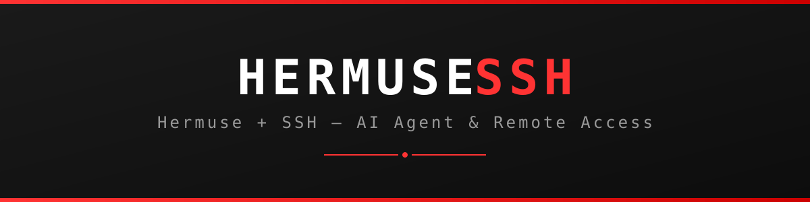

# HERMUSESSH



**AI agent stack + SSH remote access untuk VM Muse — dalam satu repo.**

## Isi Repo

```
HERMUSESSH/
├── hermuse/                    # AI agent stack (Hermes + 9Router + Telegram)
│   ├── run-hermes.sh           # Jalankan Hermes agent
│   ├── start-9router.sh        # LLM gateway di :20128
│   ├── start-gateway.sh        # Telegram bot gateway
│   ├── scripts/                # install.sh, start-all.sh, doctor.sh, dst.
│   ├── lib/                    # Library pendukung (i18n)
│   ├── tunnel/                 # Tunnel helpers
│   └── docs/                   # Dokumentasi lengkap
├── ssh/
│   ├── cloudflare-tunnel/      # SSH via Cloudflare Tunnel
│   │   ├── tcprelay.py         # TCP relay via egress proxy
│   │   ├── dns.py              # DNS server untuk SRV edge discovery
│   │   ├── rp-boot.sh          # Boot script tunnel
│   │   └── restore-after-replace.sh
│   └── tailscale-reverse/      # SSH via Tailscale reverse tunnel ✅
│       ├── reverse-tunnel.sh   # Tunnel utama (auto-reconnect)
│       ├── setup-sshd.sh       # Setup sshd di VM
│       ├── windows-setup.ps1   # Setup laptop Windows
│       └── tsconnect.py        # ProxyCommand helper
├── scripts/
│   └── vm-boot.sh              # Master auto-recovery semua service
└── docs/                       # Tutorial lengkap
```

## Bagian 1: Hermuse (AI Agent)

Self-hosted AI agent stack: Hermes Agent + 9Router (LLM gateway) + Telegram gateway.

```bash
cd hermuse
bash scripts/install.sh   # Install pertama kali
bash start-9router.sh     # LLM gateway di 127.0.0.1:20128
bash start-gateway.sh     # Telegram bot gateway
bash run-hermes.sh        # Hermes agent
```

Lihat `hermuse/docs/` untuk dokumentasi lengkap.

## Bagian 2: SSH via Tailscale Reverse ✅

Cara yang terbukti jalan. VM nelepon keluar ke laptop via Tailscale,
membuka reverse tunnel: `laptop:2223 → VM:22`.

**Di laptop Windows (sekali jalan):**
```powershell
# PowerShell sebagai Administrator:
Add-WindowsCapability -Online -Name OpenSSH.Server~~~~0.0.1.0
Start-Service sshd; Set-Service sshd -StartupType Automatic
New-NetFirewallRule -Name "SSH-Tailscale" -Direction Inbound -Protocol TCP -LocalPort 22 -RemoteAddress 100.64.0.0/10 -Action Allow
```
```cmd
:: CMD biasa:
ssh-keygen -t ed25519 -f %USERPROFILE%\.ssh\muse-key -N ""
```

**Di VM:**
```bash
# 1. Bikin kunci VM -> laptop
ssh-keygen -t ed25519 -f ~/workspace/muse-vps-tailscale/vm-to-laptop-key -N ""
# 2. Tempel vm-to-laptop-key.pub ke C:\ProgramData\ssh\administrators_authorized_keys di laptop
# 3. Tempel muse-key.pub (dari laptop) ke /root/.ssh/authorized_keys di VM
# 4. Jalankan tunnel
bash ssh/tailscale-reverse/reverse-tunnel.sh &
```

**Konek tiap hari:**
```cmd
ssh -i %USERPROFILE%\.ssh\muse-key -p 2223 root@127.0.0.1
```

Tutorial detail: [docs/TAILSCALE-TUTORIAL.id.md](docs/TAILSCALE-TUTORIAL.id.md)

## Bagian 3: SSH via Cloudflare Tunnel

Alternatif jika punya domain. Butuh tunnel token dari dashboard Cloudflare.

```bash
cd ssh/cloudflare-tunnel
# Siapkan hosts, resolv.conf, .token lalu:
bash rp-boot.sh
```

Tutorial detail: [docs/MUSESSH-README.md](docs/MUSESSH-README.md)

> **Catatan:** Cloudflare Tunnel saat ini terblokir oleh egress proxy
> yang me-reset TLS fingerprint Go. Tailscale Reverse adalah jalur utama.

## Auto-Recovery

`scripts/vm-boot.sh` dijalankan watchdog tiap 5 menit. Otomatis me-reinstall
dan me-restart yang mati: **sshd, 9Router, Telegram gateway, 9remote,
reverse SSH tunnel**. Semua file persistent di `~/workspace`.

## Perbandingan Jalur SSH

|  | Tailscale Reverse | Cloudflare Tunnel |
|---|---|---|
| Syarat | Tailscale + OpenSSH di laptop | Domain + Cloudflare account |
| Perintah konek | `ssh -i muse-key -p 2223 root@127.0.0.1` | `ssh root@ssh.domainmu.id` |
| Setup laptop | Sekali (firewall + kunci) | Tidak ada |
| Status | ✅ Jalan | ⚠️ Terblokir proxy |

## Lisensi

MIT
