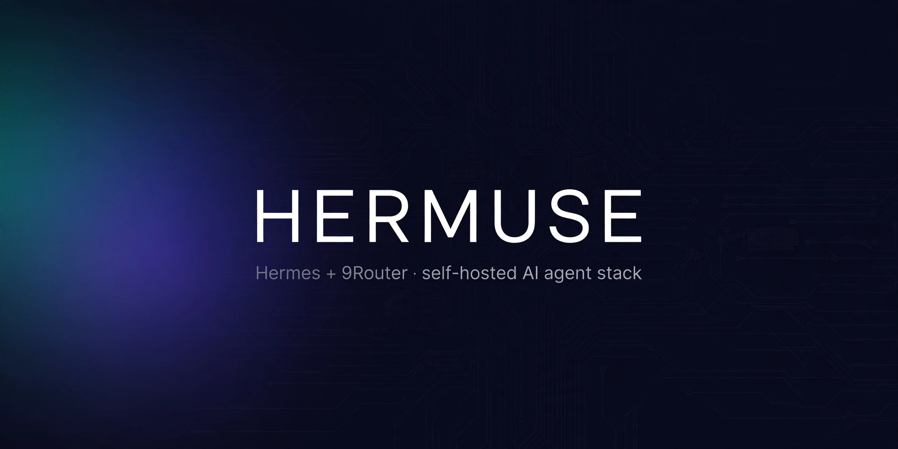

# Hermuse — self-hosted AI agent stack (Hermes + 9Router + Telegram)



[🇬🇧 English](README.md) · [🇮🇩 Indonesia](README.id.md) · 🇲🇾 **Malaysia**

[](https://github.com/imkofty/Hermuse/stargazers)
[](https://github.com/imkofty/Hermuse/network/members)
[](https://github.com/imkofty/Hermuse/issues)
[](LICENSE)
[](https://github.com/imkofty/Hermuse/actions/workflows/doctor.yml)

[](https://ubuntu.com/)
[](https://nodejs.org/)
[](https://core.telegram.org/bots)
[](https://www.cloudflare.com/)
[]()

**Hermuse = Hermes + Muse.** Skrip dan panduan untuk menjalankan Hermes Agent
(ejen AI daripada Nous Research) + 9Router + gateway Telegram di pelayan anda
sendiri — replika tepat stack yang berjalan di VM Muse.

**Hasil akhir:** bot Telegram AI peribadi anda, dalam talian 24/7 dan sedia
untuk bersembang pada bila-bila masa, serta papan pemuka (dashboard) model
yang boleh dibuka dari mana-mana pelayar.

## Mula Pantas

Apa yang anda perlukan:

- VM Linux seperti milik Muse (Ubuntu 22.04/24.04; 2 vCPU / 4 GB RAM sudah mencukupi)
- Akaun Cloudflare percuma (untuk tunnel papan pemuka)
- Bot Telegram (percuma melalui [@BotFather](https://t.me/BotFather))

**Baru dalam semua ini?** Ikuti langkah berikut mengikut turutan:

1. `bash scripts/install.sh` — pasang semuanya (kebergantungan, Hermes, 9Router)
Sahkan: `hermes --version` → memaparkan baris versi; `9router --version` → memaparkan versi
2. `hermes setup --portal` — log masuk model; `hermes gateway setup` — sambungkan bot Telegram anda
Sahkan: hantar `/start` kepada bot anda → ia membalas (ID Telegram numerik anda mestilah berada dalam senarai dibenarkan gateway)
3. `bash scripts/setup-tunnel.sh <nama-projek-pages> <nama-d1>` — pasang tunnel Cloudflare
Sahkan: `pgrep -f "tunnel-client[.]mjs"` → memaparkan PID
4. Ikuti [turutan boot yang betul](#turutan-boot-yang-betul) di bawah, kemudian letakkan watchdog pada cron
Sahkan: `bash scripts/doctor.sh` → ringkasan menunjukkan `0 FAIL`

Sudah selesa dan mahu skrip operasi secara langsung? Lihat jadual
[susun atur fail](#susun-atur-fail).

## Cara ia berfungsi

```
Telegram (anda)
   │ polling
   ▼
Hermes gateway  ──▶  model:
   (run-hermes.sh)        ├─▶ Nous (direct, via OAuth / API key)
                          └─▶ 9Router  (127.0.0.1:20128, OpenAI-compatible)

Browser (internet)
   │ plain HTTPS
   ▼
<projek-anda>.pages.dev  (Cloudflare Pages Functions)
   │ request/response queue
   ▼
D1  (tunnel_requests / tunnel_responses tables)
   ▲ ~20s HTTPS long-poll
   │
tunnel-client.mjs  (pada VM anda)
   │ forward
   ▼
9Router at 127.0.0.1:20128
```

**Kenapa long-poll?** Endpoint `/__tunnel/poll` mengekalkan sambungan selama
~20 saat apabila barisan kosong sebelum membalas (atau membalas serta-merta
apabila permintaan tiba). Tanpa ini, polling setiap 400ms–2.5s akan
menghabiskan kuota **100k permintaan/hari** peringkat percuma Cloudflare
Workers dalam beberapa jam; dengan long-poll, penggunaan melahu turun kepada
~4,300 permintaan/hari. Lihat
`tunnel/pages-tunnel/functions/__tunnel/poll.js` untuk pelaksanaannya.

9Router hanya bind pada `127.0.0.1` (selamat, tidak pernah didedahkan).
Tunnel polling digunakan kerana pada rangkaian VM asal, sambungan WebSocket,
QUIC/UDP, dan `cloudflared` ke edge semuanya gagal — lihat
[arkib kegagalan](docs/arsip-tunnel-gagal.md). Pada VM/rangkaian biasa,
`cloudflared` biasa mungkin lebih mudah.

## Susun atur fail

| Fail | Peranan |
|---|---|
| `run-hermes.sh` | Menjalankan Hermes CLI melalui venv yang diperuntukkan (menetapkan `HERMES_HOME`, `no_proxy` yang minimum). Laraskan `HERMES_VENV` / `HERMES_SRC` di bahagian atas fail. |
| `start-gateway.sh` | Menjalankan gateway Telegram secara detached (`setsid`+`nohup`). |
| `start-9router.sh` | Supervisor 9Router: bind `127.0.0.1:20128`, mula semula automatik jika crash. Kata laluan papan pemuka dibaca dari `.dashboard-pw` (600). |
| `start-pages-tunnel.sh` | Supervisor tunnel client (`tunnel-client.mjs`), mula semula automatik. |
| `restart-9router.sh` | Mematikan proses 9Router lama (pola selamat, anti self-kill) + memulakan supervisor secara detached. |
| `restart-tunnel.sh` | Mematikan tunnel client lama + memulakan supervisor secara detached. |
| `watchdog.sh` | Memeriksa 9Router, tunnel client, gateway; memulakan semula apa yang mati. Untuk cron. |
| `gateway-watch.sh` | Watchdog anti-stall untuk gateway Telegram: mengesan stall senyap melalui event-loop heartbeat + aktiviti adapter, bukan sekadar "proses hidup". Untuk cron (setiap 5 minit). |
| `tunnel-client.mjs` | Client polling: menarik barisan dari Pages, memajukan kepada 9Router tempatan, menghantar respons kembali. |
| `tunnel/` | Skema D1 (`schema.sql`) + Pages Functions + `wrangler.toml.example`. |
| `scripts/install.sh` | Pemasangan dari kosong: kebergantungan, Node.js LTS, Hermes, 9Router. |
| `scripts/setup-tunnel.sh` | Persediaan tunnel: jana kunci → cipta D1 → deploy Pages → tetapkan secret. |
| `docs/arsip-tunnel-gagal.md` | Arkib: kegagalan `cloudflared` & Tailscale pada rangkaian VM asal (dalam Bahasa Indonesia). |

## Turutan boot yang betul

Jalankan mengikut turutan (sekali sudah cukup; supervisor + watchdog
menguruskan selebihnya):

1. 9Router dahulu (supervisor detached, mula semula automatik):
   `bash restart-9router.sh`
Sahkan: `curl -s -o /dev/null -w '%{http_code}' http://127.0.0.1:20128/dashboard` → memaparkan `200` atau `307` (307 = redirect ke log masuk, normal)

2. Tunnel client (memerlukan `TUNNEL_BASE_URL` atau fail `.tunnel-url`):
   `export TUNNEL_BASE_URL='https://<projek-anda>.pages.dev'` kemudian `bash restart-tunnel.sh`
Sahkan: `pgrep -f "tunnel-client[.]mjs"` → memaparkan PID

3. Gateway Telegram (detached):
   `bash start-gateway.sh`
Sahkan: `pgrep -f "[g]ateway['\", ]+run"` → memaparkan tepat satu PID

Kemudian buka `https://<projek-anda>.pages.dev` dalam pelayar — papan
pemuka 9Router sepatutnya muncul. Jika anda mendapat
`504 tunnel timeout (client offline?)`, tunnel client belum berjalan.
## Watchdog (cron setiap 5 minit)

```bash
crontab -e
# tambah baris ini (laraskan laluannya):
*/5 * * * * /path/to/Hermuse/watchdog.sh
```

Watchdog memeriksa tiga perkara — 9Router (`curl` ke `/dashboard`), tunnel
client (`pgrep tunnel-client[.]mjs`), gateway Telegram (`gateway.*run`) —
dan memulakan semula apa yang mati melalui skrip `restart-*`. Ia kekal
senyap (tidak menulis log) apabila semuanya sihat; ia hanya menulis log
apabila benar-benar memulakan semula sesuatu.

> Untuk cron: simpan URL tunnel dalam fail `.tunnel-url` (chmod 600) di
> folder ini, kerana cron tidak mewarisi pemboleh ubah persekitaran
> interaktif anda:
> `echo -n 'https://<projek-anda>.pages.dev' > .tunnel-url && chmod 600 .tunnel-url`

## Watchdog gateway anti-stall (pilihan tetapi disyorkan)

`watchdog.sh` di atas hanya memeriksa "proses wujud atau tidak". Jika
polling Telegram stall sedangkan proses masih hidup, ia terlepas.
`gateway-watch.sh` menutup jurang itu dengan tiga lapisan:

1. PID gateway tiada → mulakan semula serta-merta.
2. Event-loop heartbeat (`$HERMES_HOME/state/gateway.heartbeat`, ditulis
   automatik oleh gateway) basi >120s → mulakan semula serta-merta.
3. Heartbeat segar tetapi 0 aktiviti adapter Telegram dalam `gateway.log`
   selama 15 minit → tandakan suspek, mulakan semula jika disahkan pada 2
   larian berturut-turut.

Peraturan keras: hanya kill apabila terdapat tepat 1 calon PID (tiada
kekaburan). Tidak menyentuh 9Router. Dry-run tanpa tindakan sebenar:
`DRY_RUN=1 bash gateway-watch.sh`.

```bash
crontab -e
# tambah (boleh berselang-seli dengan watchdog.sh):
*/5 * * * * /path/to/Hermuse/gateway-watch.sh
```

## Mula automatik selepas reboot

`scripts/start-all.sh` memulakan mana-mana komponen Hermuse yang down
(9Router, tunnel client, gateway Telegram) — idempotent, komponen yang
berjalan tidak disentuh:

```bash
bash /path/to/Hermuse/scripts/start-all.sh
```

Untuk menjalankannya secara automatik pada setiap reboot VPS, untuk VPS
Linux biasa:

**Pilihan 1 — cron `@reboot`:**

```bash
crontab -e
# tambah:
@reboot sleep 30 && /path/to/Hermuse/scripts/start-all.sh >> /path/to/Hermuse/boot.log 2>&1
```

**Pilihan 2 — unit user systemd** (`~/.config/systemd/user/hermuse.service`):

```ini
[Unit]
Description=Hermuse stack (9Router + tunnel + Telegram gateway)
After=network-online.target
Wants=network-online.target

[Service]
Type=oneshot
ExecStart=/path/to/Hermuse/scripts/start-all.sh
RemainAfterExit=yes

[Install]
WantedBy=default.target
```

```bash
systemctl --user daemon-reload
systemctl --user enable --now hermuse.service
# untuk berjalan tanpa log masuk: sudo loginctl enable-linger $USER
```

(Kedua-dua contoh adalah untuk VPS/rangkaian biasa dan belum diuji pada
setiap distro — sesuaikan dengan sistem anda. Cron watchdog 5 minit masih
disyorkan sebagai jaring keselamatan.)

## Pasang dari kosong

Bermula dari kosong? Mulakan di sini:

```bash
bash scripts/install.sh        # kebergantungan + Node.js + Hermes + 9Router + hermes doctor
```
(memerlukan `sudo` tanpa kata laluan, atau jalankan sebagai root — skrip gagal cepat jika tidak)

Kemudian wizard pembekal model & gateway Telegram:

```bash
hermes setup --portal   # log masuk ke Nous melalui OAuth (atau: hermes model untuk memilih pembekal)
hermes gateway setup    # masukkan token bot Telegram anda + senarai dibenarkan ID numerik
```

Akhir sekali, persediaan tunnel Cloudflare:

```bash
CLOUDFLARE_API_TOKEN='<token>' bash scripts/setup-tunnel.sh <nama-projek-pages> <nama-d1>
```

(Token Cloudflare digunakan secara transient — ia tidak disimpan dalam mana-mana fail.)

## Keselamatan — jangan langkau

- Fail secret **sentiasa `chmod 600`** dan **tidak pernah di-commit**:
  `.env`, `.tunnel-key`, `.tunnel-url`, `.dashboard-pw`, `wrangler.toml`
  (semuanya diliputi oleh `.gitignore`).
- Gateway Telegram: **default-deny**. Hanya ID numerik dalam
  `TELEGRAM_ALLOWED_USERS` boleh menggunakan bot (`TELEGRAM_BOT_TOKEN` +
  `TELEGRAM_ALLOWED_USERS` berada dalam `.env`).
- **Tukar kata laluan papan pemuka 9Router daripada yang lalai** sejurus
  selepas pasang — terutamanya kerana URL tunnel adalah awam.
- Jangan dedahkan port 20128 ke internet tanpa perlindungan; 9Router hanya
  bind pada `127.0.0.1`.
- Jika token bot Telegram anda bocor: `/revoke` di @BotFather, gantikannya
  dalam `.env`, mulakan semula gateway.

## Nota

<details>
<summary><strong>Kegagalan rangkaian asal (arkib)</strong></summary>

Pada rangkaian VM asal, dua pendekatan standard **gagal sepenuhnya**:

- **Cloudflare Tunnel (`cloudflared`)** — QUIC/UDP disekat, TLS ke IP edge
  dipintas, proksi menolak CONNECT ke port 7844.
- **Tailscale** — control plane tidak dapat menembusi rangkaian (HTTP 400
  dari MITM).

Butiran + contoh konfigurasi yang disanitasi:
[docs/arsip-tunnel-gagal.md](docs/arsip-tunnel-gagal.md) (dalam Bahasa
Indonesia). Pada VM/rangkaian biasa kedua-duanya mungkin laluan termudah.

</details>

## Lesen

MIT.
